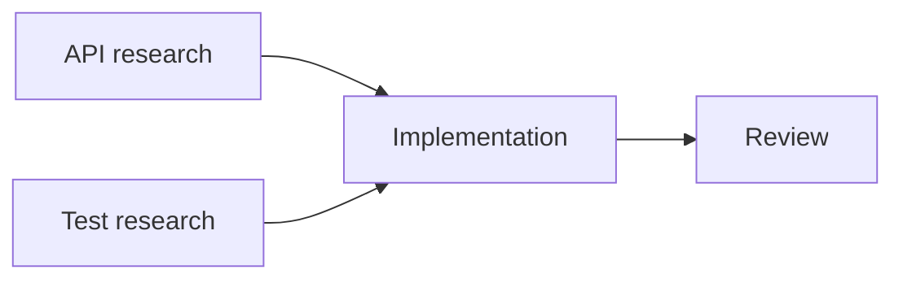
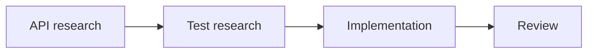

# Questionnaire design examples

Open this library for the design problem named in a heading. Diagnose the decision first, then adapt the rewrite to the verified facts. Do not copy a domain example merely because its nouns match.

## Hidden constraint

### Weak item

```json
{
  "questions": [
    {
      "id": "analyzer-integration",
      "label": "1. Analyzer API",
      "question": "Should guardrails use the CLI or package API?",
      "type": "single",
      "options": [
        { "label": "CLI" },
        { "label": "Package API" }
      ]
    }
  ]
}
```

### Defect

The choice assumes both interfaces are supported. The installed package has a structured CLI response but no public analyzer API, which changes the maintenance risk of the second option.

### Rewrite

```json
{
  "questions": [
    {
      "id": "analyzer-integration",
      "label": "1. Analyzer API",
      "question": "The installed package supports a structured CLI response but has no public analyzer API. How should guardrails call it? I recommend putting the supported CLI behind our own interface so one adapter contains process and validation behavior.",
      "type": "single",
      "options": [
        {
          "label": "CLI adapter (recommended)",
          "description": "Uses the supported JSON command and isolates process startup in one adapter. It adds a subprocess per call, but package upgrades do not depend on private files."
        },
        {
          "label": "Private package files",
          "description": "Calls internal code in the Pi process and avoids subprocess startup. An ordinary package update may move those undocumented files, unlike the supported CLI contract."
        }
      ]
    }
  ]
}
```

### Why it passes

The verified constraint appears once in the question. Each option explains how that fact affects runtime and maintenance.

## Necessary jargon

### Weak item

```json
{
  "questions": [
    {
      "id": "migration-strategy",
      "label": "2. Migration",
      "question": "Should we use expand and contract or dual write?",
      "type": "single",
      "options": [
        { "label": "Expand and contract" },
        { "label": "Dual write" }
      ]
    }
  ]
}
```

### Defect

The strategy names are precise but do not tell an unfamiliar user how deployment, rollback, or ongoing writes change.

### Rewrite

```json
{
  "questions": [
    {
      "id": "migration-strategy",
      "label": "2. Migration",
      "question": "Old and new application versions may run together while `customer_name` is renamed. How should the migration keep both versions working? I recommend expand and contract because it permits rollback during deployment without maintaining two permanent write paths.",
      "type": "single",
      "options": [
        {
          "label": "Expand and contract (recommended)",
          "description": "Add the new column, support both names, backfill, then remove the old column in a later release. This keeps both versions working and permits rollback, but requires two releases and temporary compatibility code."
        },
        {
          "label": "Dual write indefinitely",
          "description": "Send every change to both columns so either application version can read its expected name. Compatibility remains, but every future write path must synchronize both columns and repair partial failures."
        }
      ]
    }
  ]
}
```

### Why it passes

Each technical term is retained and defined by deployment behavior the user can observe.

## A valid bundle

### Weak item

```json
{
  "questions": [
    {
      "id": "delivery-mode",
      "label": "3. Delivery mode",
      "question": "Which delivery features should we enable?",
      "type": "multiple",
      "options": [
        { "label": "Queue" },
        { "label": "Worker" },
        { "label": "Queue and worker" }
      ]
    }
  ]
}
```

### Defect

The combined option overlaps with selecting the first two. The item also implies that a queue or worker can deliver jobs alone when this implementation requires both.

### Rewrite

```json
{
  "questions": [
    {
      "id": "delivery-mode",
      "label": "3. Delivery mode",
      "question": "How should background jobs be delivered? The queued design requires both a queue and a worker. I recommend that package because it retries failed work without blocking the request.",
      "type": "single",
      "options": [
        {
          "label": "Queue plus worker (recommended)",
          "description": "Requests enqueue work and a worker processes it with retries. It survives temporary failures, but adds a queue service and worker operations."
        },
        {
          "label": "In-process delivery",
          "description": "The request performs the work directly with no queue service. It has fewer moving parts, but slow or failed work delays the request and has no independent retry path."
        }
      ]
    }
  ]
}
```

### Why it passes

The bundle is one indivisible strategy, so it is compared with another complete strategy in a `single` question.

## No material downside

### Weak item

```json
{
  "questions": [
    {
      "id": "invalid-timeout",
      "label": "4. Invalid timeout",
      "question": "Should invalid timeout values be rejected?",
      "type": "single",
      "options": [
        {
          "label": "Reject",
          "description": "Reject invalid values, but add another validation branch."
        },
        {
          "label": "Accept",
          "description": "Accept every number, but runtime calls may fail."
        }
      ]
    }
  ]
}
```

### Defect

The first description promotes a trivial implementation detail into a product cost. Under the stated contract, invalid values are already unsupported.

### Rewrite

```json
{
  "questions": [
    {
      "id": "invalid-timeout",
      "label": "4. Invalid timeout",
      "question": "How should configuration handle timeout values below the supported 100 ms minimum? I recommend rejecting them during validation so an invalid request cannot reach runtime code.",
      "type": "single",
      "options": [
        {
          "label": "Reject during validation (recommended)",
          "description": "Configuration fails with a focused error before requests start. No material compatibility cost is known because values below 100 ms are outside the supported contract."
        },
        {
          "label": "Accept and fail later",
          "description": "Configuration loads without a new validation error. Runtime requests may then fail far from the invalid setting, unlike early rejection."
        }
      ]
    }
  ]
}
```

### Why it passes

The recommended option states its actual boundary instead of inventing a symmetrical downside.

## Dependent questions

### Weak item

One `ask_user` call asks both:

1. "Should audit history survive a session reload?"
2. "Which database should persist audit history?"

### Defect

The second question assumes that persistence was selected in the first. If the user chooses memory-only history, every database option is stale.

### Rewrite

Round 1 asks only the retention decision:

```json
{
  "questions": [
    {
      "id": "audit-retention",
      "label": "5. Audit retention",
      "question": "Should audit history survive a session reload? I recommend session retention so earlier blocks remain explainable after reopening the work.",
      "type": "single",
      "options": [
        {
          "label": "Retain with session (recommended)",
          "description": "History remains available when this session reloads. It stores session data, unlike memory-only history."
        },
        {
          "label": "Memory only",
          "description": "History disappears when Pi exits. It stores nothing after shutdown, but earlier blocks cannot be inspected after reopening."
        }
      ]
    }
  ]
}
```

Ask about the storage mechanism in round 2 only if the user selects retention.

### Why it passes

Every question in the call can be answered without knowing another answer from that call.

## Matched Mermaid structures

### Weak item

The recommended option receives a dependency graph. The alternative receives only "Run the work sequentially."

### Defect

The recommendation gets an unfair clarity advantage. The user cannot compare critical paths or concurrency from equivalent views.

### Rewrite

Use the same tasks, direction, and labels in both option descriptions.

Option: `Parallel research (recommended)`

Result: API and test research run together before implementation. This shortens the critical path, but implementation must wait for both results.



Option: `Sequential research`

Result: Test research waits for API research before implementation. Coordination is simpler, but the second investigation cannot start early.



### Why it passes

Both complete graphs use the same notation. Only the dependency structure changes, and prose still states the result and cost.

## Matched exact output

### Weak item

```json
{
  "questions": [
    {
      "id": "retry-format",
      "label": "7. Retry format",
      "question": "How should the plan describe the retry change?",
      "type": "single",
      "options": [
        { "label": "Diff" },
        { "label": "Prose" }
      ]
    }
  ]
}
```

### Defect

The user is choosing a representation without seeing either proposed result.

### Rewrite

Use the same retry change in both descriptions.

Option: `Focused diff (recommended)`

Result: The implementer sees the exact key, old value, new value, and unchanged neighbor. It takes more rows than prose but matches the file being edited.

```diff:yaml
 retry_policy:
-  max_attempts: 3
+  max_attempts: 5
   backoff_ms: 250
```

Option: `Prose instruction`

Result: The plan stays short. The implementer must locate the key and cannot verify its old value from the task.

```text
Increase the retry limit to five attempts.
```

### Why it passes

The source case is constant and each complete output is shown in its native form. The user judges the literal difference instead of imagining it.
